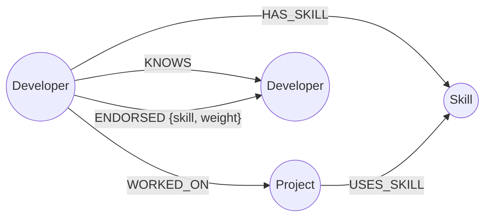
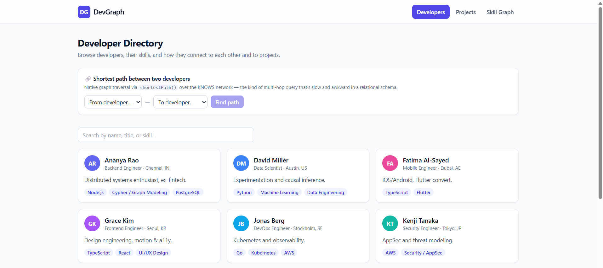
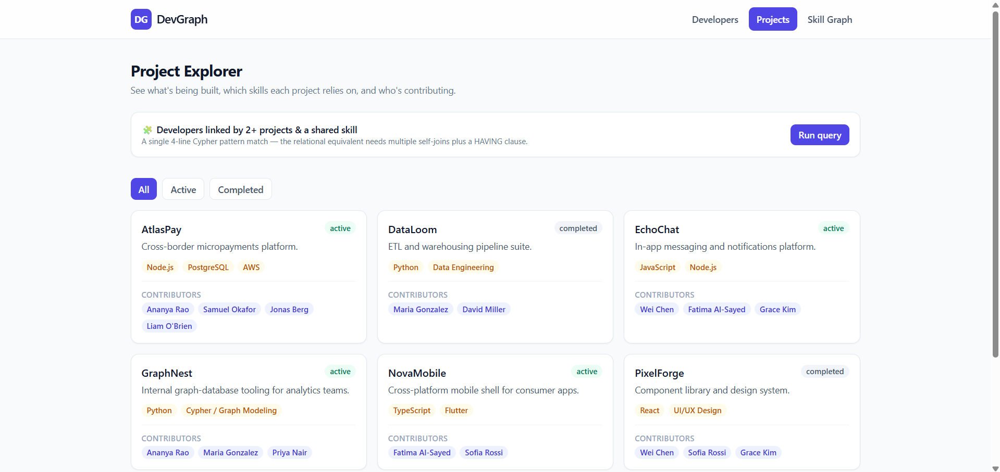
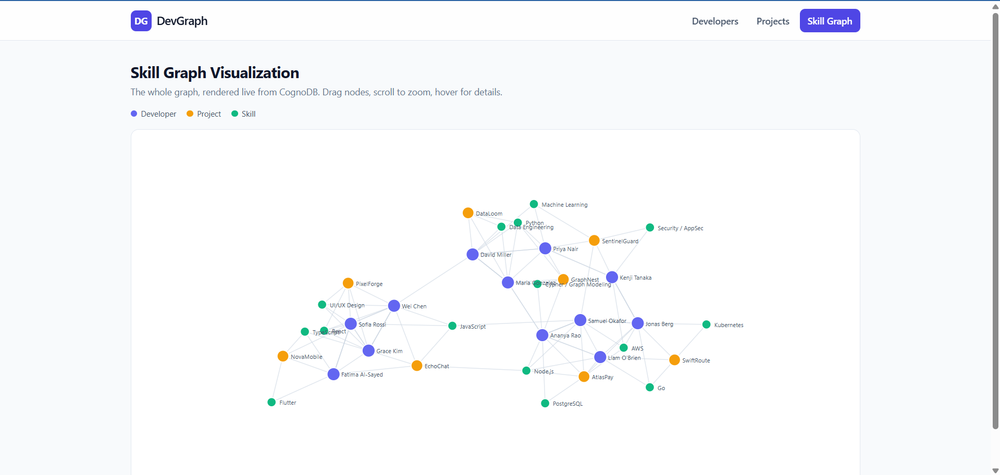

# DevGraph — Developer Networking Platform

A graph-database application built for the **WEXA AI take-home assignment**.
DevGraph models developers, the projects they've worked on, and the skills
they hold — plus the relationships between all three — and uses those
relationships to answer questions a relational database handles poorly:
*"who's two projects and a shared skill away from whom?"*, *"what's the
shortest social path between two engineers?"*, *"what should I learn next
based on my network?"*

| | |
|---|---|
| **Live demo (frontend)** | `<add your Vercel/Netlify URL here>` |
| **Live demo (API)** | `<add your Render/Railway URL here>` |
| **Screen recording** | `<add your Loom/YouTube link here>` |

---

## 1. Use case

**Developer Networking Platform.** Nodes represent `Developer`, `Project`,
and `Skill` entities. Relationships capture how they interact:

- `(:Developer)-[:WORKED_ON]->(:Project)` — who built what
- `(:Developer)-[:HAS_SKILL]->(:Skill)` — who knows what
- `(:Project)-[:USES_SKILL]->(:Skill)` — what a project requires
- `(:Developer)-[:KNOWS]-(:Developer)` — who's connected to whom
- `(:Developer)-[:ENDORSED]->(:Developer)` — peer skill endorsements (with a `skill` + `weight` property)

The product surface (directory, project explorer, graph visualizer) is a
thin, honest presentation layer over these relationships — every "smart"
feature in the UI (skill recommendations, shortest path, multi-hop
matches) is a direct read of a graph traversal, not a synthetic feature
bolted on afterward.

## 2. Why a graph database?

The relationships *are* the product here, not an afterthought bolted onto
rows. Two queries make the case concretely:

**a) "Find developers connected through two different projects who also
share at least one skill."**

In Cypher this is a readable, constant-cost pattern match:

```cypher
MATCH (a:Developer)-[:WORKED_ON]->(p1:Project)<-[:WORKED_ON]-(b:Developer)
MATCH (a)-[:WORKED_ON]->(p2:Project)<-[:WORKED_ON]-(b)
WHERE a.id < b.id AND p1 <> p2
MATCH (a)-[:HAS_SKILL]->(shared:Skill)<-[:HAS_SKILL]-(b)
RETURN a.name, b.name, collect(DISTINCT p1.name) + collect(DISTINCT p2.name), collect(DISTINCT shared.name)
```

In a relational schema, the same question needs a self-join across a
`project_members` bridge table (twice, to enforce "two different
projects"), a `HAVING COUNT(DISTINCT project_id) >= 2`, and a correlated
`EXISTS` subquery against `developer_skills` to check the shared-skill
condition. It's not impossible — it's just several joins deep, harder to
read, and gets worse (not better) as you add hops.

**b) "Shortest path between two developers through the KNOWS network."**

```cypher
MATCH (a:Developer {id: $fromId}), (b:Developer {id: $toId})
MATCH path = shortestPath((a)-[:KNOWS*..8]-(b))
RETURN [n IN nodes(path) | n.name], length(path)
```

Relationally this needs a recursive CTE with manual cycle detection and a
depth cap, and its cost grows with the branching factor of the network at
every hop. A graph database stores adjacency directly (each node knows
its own relationships), so traversal cost depends on the *path length*,
not the size of the whole dataset — this stays fast as the network grows,
where the relational join-heavy equivalent gets progressively slower.

Both queries are live in the app: the shortest-path finder sits at the
top of the Developer Directory, and the multi-hop matcher sits at the top
of the Project Explorer.

## 3. Data model

```
                 HAS_SKILL                    USES_SKILL
   (Developer) ─────────────▶ (Skill) ◀───────────────── (Project)
        │  ▲                                                  ▲
        │  │ KNOWS (undirected, self-relationship)            │
        │  └──────────────────────────────────────────────────┘
        │                                                WORKED_ON
        │  ENDORSED (directed, has `skill` + `weight` props)
        └───────────────────────────────▶ (Developer)
```

Mermaid version (renders on GitHub):



**Node properties**

| Label | Properties |
|---|---|
| `Developer` | `id`, `name`, `title`, `location`, `avatarColor`, `bio` |
| `Project` | `id`, `name`, `description`, `status`, `startDate` |
| `Skill` | `id`, `name`, `category` |

**Relationship properties**

| Type | Direction | Properties |
|---|---|---|
| `WORKED_ON` | Developer → Project | `role` |
| `HAS_SKILL` | Developer → Skill | — |
| `USES_SKILL` | Project → Skill | — |
| `KNOWS` | Developer — Developer (undirected) | `since` |
| `ENDORSED` | Developer → Developer | `skill`, `weight` |

Uniqueness constraints on `id` for all three node labels are created by
the seed script (`CREATE CONSTRAINT ... IF NOT EXISTS`).

## 4. Project structure

```
wexa-graph-app/
├── backend/                 # Express API (Node.js + neo4j-driver)
│   ├── src/
│   │   ├── db/cognoDriver.js       # CognoDB connection (env-driven)
│   │   ├── routes/                 # developers, projects, skills, graph
│   │   ├── queries/cypherQueries.js  # all Cypher, parameterized
│   │   ├── middleware/asyncHandler.js
│   │   └── server.js
│   ├── package.json
│   └── .env.example
├── frontend/                 # React (Vite) + Tailwind
│   ├── src/
│   │   ├── api/client.js            # fetch wrapper, typed errors
│   │   ├── components/              # Navbar, states, GraphVisualization (D3), etc.
│   │   ├── pages/                   # DeveloperDirectory, ProjectExplorer, SkillGraphPage
│   │   └── hooks/useApi.js
│   ├── package.json
│   └── .env.example
├── data/
│   ├── developers.json / projects.json / skills.json / relationships.json
│   ├── seed.js               # idempotent loader (parameterized Cypher)
│   └── queries.cypher        # standalone reference queries
├── docs/screenshots/         # UI screenshots (see below)
└── README.md
```

## 5. Setup instructions

### Prerequisites
- Node.js ≥ 18
- A running CognoDB instance reachable over Bolt (or any Neo4j-compatible
  server for local development — the driver protocol is identical)

### 1. Clone and install

Each of the three JS folders (`backend`, `frontend`, and `data`) has its
own dependencies — install all three, or the seed script will fail with
`Cannot find module 'dotenv'` even though `backend` installed fine.

```bash
git clone <your-repo-url>
cd wexa-graph-app

cd backend && npm install
cd ../frontend && npm install
cd ../data && npm init -y && npm install dotenv neo4j-driver
```

### 2. Configure environment variables

```bash
cp backend/.env.example backend/.env
cp frontend/.env.example frontend/.env
```

Edit `backend/.env`:

```
COGNODB_URI=bolt://localhost:7687
COGNODB_USER=neo4j
COGNODB_PASSWORD=changeme
COGNODB_DATABASE=neo4j
PORT=4000
CORS_ORIGIN=http://localhost:5173
```

> **Using a hosted CognoDB/Aura-style free instance instead of local?**
> Get your exact values from the credentials file offered for download
> the moment your instance is created (only shown once) — don't guess
> them. In particular:
> - `COGNODB_URI` uses `neo4j+s://` (not `bolt://`) and looks like
>   `neo4j+s://<instance-id>.databases.neo4j.io`
> - `COGNODB_USER` may **not** be the literal word `neo4j` — free
>   instances often generate a random username (e.g. `cf4dd388`)
> - `COGNODB_DATABASE` may also **not** be `neo4j` — it's frequently
>   the same string as your instance ID. Using the wrong value here
>   produces `Unable to get a routing table for database 'neo4j'
>   because this database does not exist` even though the connection
>   itself succeeded.
> - A freshly created free instance can take **up to a minute or two**
>   after showing "Running" before it actually accepts connections.
>   If you see a connectivity error immediately after creating one,
>   wait ~60 seconds and retry before assuming something is
>   misconfigured.

Edit `frontend/.env`:

```
VITE_API_BASE_URL=http://localhost:4000/api
```

> Never commit real `.env` files — they're already git-ignored.

### 3. Seed the database

```bash
cd backend
npm run seed
```

This loads `data/developers.json`, `data/projects.json`,
`data/skills.json`, and `data/relationships.json` into CognoDB using
parameterized `UNWIND ... MERGE` Cypher (safe to re-run).

### 4. Run the app

```bash
# Terminal 1
cd backend && npm run dev

# Terminal 2
cd frontend && npm run dev
```

Visit `http://localhost:5173`. The API health check is at
`http://localhost:4000/api/health` and reports both API liveness and
CognoDB reachability.

> Keep **both** terminals (backend and frontend) open and running for
> as long as you're using the app. If either one is stopped — or your
> machine sleeps and kills the process — the frontend will show a red
> "CognoDB is currently unreachable" banner even if the database
> itself is perfectly healthy. Just restart `npm run dev` in the
> terminal that stopped.

### Troubleshooting quick reference

| Symptom | Likely cause | Fix |
|---|---|---|
| `Cannot find module 'dotenv'` when running `npm run seed` | `data/` folder has no `node_modules` of its own | `cd data && npm install dotenv neo4j-driver` |
| `Unable to get a routing table for database 'neo4j' because this database does not exist` | `COGNODB_DATABASE` is wrong (often needs to be your instance ID, not `neo4j`) | Check the exact value in your instance's downloaded credentials file |
| `Failed to connect to server` right after creating a hosted instance | Instance hasn't finished warming up yet | Wait ~60 seconds and retry |
| Frontend shows "CognoDB is currently unreachable" | Backend process (or frontend process) isn't running | Restart `npm run dev` in the relevant terminal |
| Graph page crashes with `node not found: <id>` | (Fixed in this codebase) D3 node/link id mismatch | Already handled in `backend/src/routes/graph.js` — pull latest |

## 6. API reference

| Method | Path | Description |
|---|---|---|
| GET | `/api/health` | API + CognoDB connectivity check |
| GET | `/api/developers` | Directory listing with skills |
| GET | `/api/developers/:id` | Profile: skills, projects, connections |
| GET | `/api/developers/:id/recommendations` | Skills your 1-2 hop network has that you don't |
| GET | `/api/developers/path/:fromId/:toId` | Shortest KNOWS path between two developers |
| GET | `/api/projects` | Project listing with contributors + skills |
| GET | `/api/projects/:id` | Single project detail |
| GET | `/api/skills` | Skills ranked by developer count |
| GET | `/api/skills/:name/top-endorsed` | Endorsement leaderboard for a skill |
| GET | `/api/graph` | Full graph (nodes + edges) for visualization |
| GET | `/api/graph/connected-via-two-projects` | The flagship multi-hop query |

All queries are parameterized server-side (see
`backend/src/queries/cypherQueries.js`) — no request ever concatenates
user input into a Cypher string.

## 7. Error handling

- **DB unreachable at startup**: the API still boots (so `/api/health`
  is always reachable) but data routes return `503` with a clear
  message until CognoDB comes back.
- **DB unreachable mid-request**: the centralized Express error handler
  detects connectivity errors (`ServiceUnavailable`, `ECONNREFUSED`,
  etc.) and returns a `503` instead of a raw stack trace.
- **Frontend**: every data-driven page has explicit loading, error
  (with retry), and empty states — see `frontend/src/components/`. A
  global banner also warns if CognoDB is down, using `/api/health`.

## 8. Deployment

- **Frontend**: deploy `frontend/` to Vercel or Netlify. Set
  `VITE_API_BASE_URL` to your deployed backend's `/api` URL.
- **Backend**: deploy `backend/` to Render or Railway (free tier). Set
  `COGNODB_URI`, `COGNODB_USER`, `COGNODB_PASSWORD`, `COGNODB_DATABASE`,
  and `CORS_ORIGIN` (your frontend's deployed origin) as environment
  variables in the hosting dashboard — never in code.

## 9. Screenshots

> Add screenshots to `docs/screenshots/` and reference them here, e.g.:
>
> 
> 
> 

## 10. Screen recording

> Add a short (2-4 min) walkthrough covering: the directory, the
> shortest-path finder, the multi-hop project/skill matcher, and the
> live D3 graph visualization. Link it at the top of this README.

## 11. Tech stack summary

- **Database**: CognoDB (openCypher over Bolt, Neo4j-driver compatible)
- **Backend**: Node.js, Express, official `neo4j-driver`
- **Frontend**: React 18 (hooks, functional components), React Router,
  Vite
- **Styling**: TailwindCSS
- **Visualization**: D3.js force-directed graph
- **Hosting**: Vercel/Netlify (frontend), Render/Railway (backend) —
  free tiers

## License

MIT — see [LICENSE](LICENSE).
